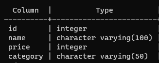
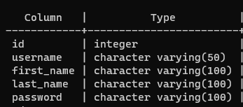

# API Requirements
The company stakeholders want to create an online storefront to showcase their great product ideas. Users need to be able to browse an index of all products, see the specifics of a single product, and add products to an order that they can view in a cart page. You have been tasked with building the API that will support this application, and your coworker is building the frontend.

These are the notes from a meeting with the frontend developer that describe what endpoints the API needs to supply, as well as data shapes the frontend and backend have agreed meet the requirements of the application. 

## API Endpoints
#### Products
- Index `GET` `http://localhost:3000/products`
- Show `GET` `http://localhost:3000/products/{product_id}`
- Create [token required] `POST` `http://localhost:3000/products` [request body](#Product)
- [OPTIONAL] Top 5 most popular products `GET` `http://localhost:3000/products/top/{number}`
- [OPTIONAL] Products by category (args: product category) `GET` `http://localhost:3000/products/category/{category}`

#### Users
- Index [token required] `GET` `http://localhost:3000/users`
- Show [token required]  `GET` `http://localhost:3000/users/{user_id}` 
- Create [token required] `POST` `http://localhost:3000/users` [request body](#User)

#### Orders
- Current Order by user (args: user id)[token required] `GET` `http://localhost:3000/users/{user_id}/orders`
- [OPTIONAL] Completed Orders by user (args: user id)[token required] `GET` `http://localhost:3000/users/{user_id}/orders/complete`

## Data Shapes and Schema
#### Product
- id `number`
- name `string`
- price `number`
- [OPTIONAL] category `string`

#### Products Table Schema

#### User
- id `number`
- firstName `string`
- lastName `string`
- password `string`
#### Users Table Schema

#### Orders
- id `number`
- user_id `number`
- status of order (active or complete) `string`
#### Orders Table Schema

### OrderProduct
- id `number`
- product_id of each product in the order `number`
- quantity of each product in the order `number`
#### Order Products Table Schema

